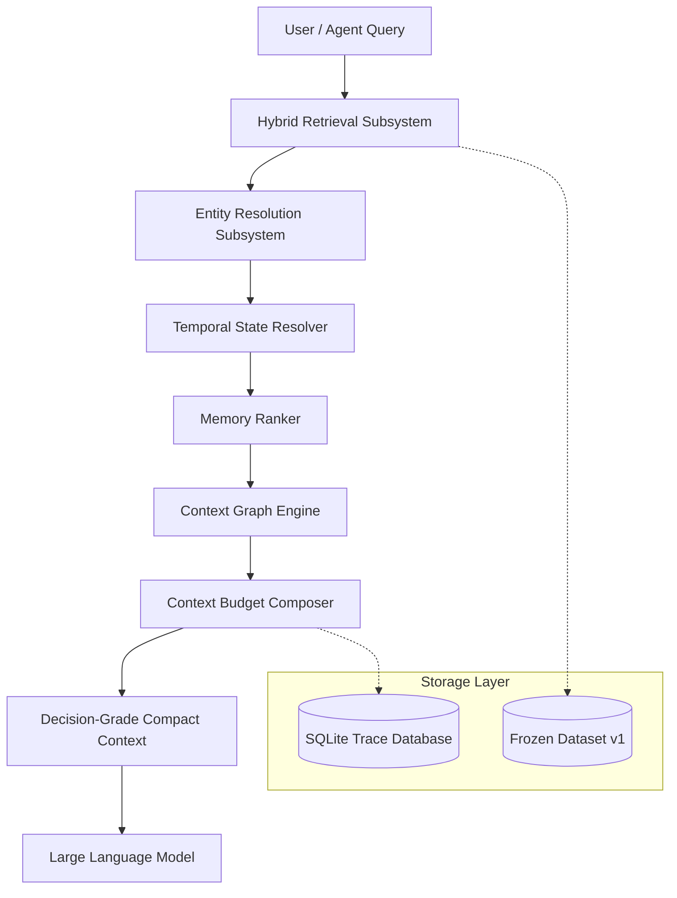

# ContextOS

**Context compilation infrastructure for AI agents.**

ContextOS transforms messy, conflicting, temporally changing agent memory into decision-ready context before it reaches a Large Language Model (LLM).

[](file:///D:/GITHUB%20AUTOMATION/repos/ContextOS/reproducibility)
[](https://python.org)
[](https://nextjs.org)
[](file:///D:/GITHUB%20AUTOMATION/repos/ContextOS/LICENSE)
[](file:///D:/GITHUB%20AUTOMATION/repos/ContextOS/BENCHMARKS.md)

---

## 📌 The Problem

Autonomous AI agents operating over extended timelines encounter severe context degradation. Traditional Retrieval-Augmented Generation (RAG) systems retrieve documents based on semantic or keyword similarity to a query, but **retrieving relevant text is not the same as constructing the correct decision context**.

### Practical Example

Consider a sales automation agent managing an enterprise account over time:

* **Jan 10 (Meeting Note):** *"Project Atlas placed on legal hold pending compliance audit."*
* **Jan 14 (Slack Update):** *"UPDATE: Legal audit cleared for Project Atlas. Outreach authorized."*
* **Jan 16 (Sales Inquiry):** *"Should sales contact the client regarding Project Atlas?"*

**Why Naive RAG Fails:**
1. **Temporal Conflict:** A standard vector search or BM25 retriever returns both the Jan 10 note and Jan 14 Slack message due to high keyword overlap (`Project Atlas`, `legal`). The LLM receives conflicting instructions and frequently selects the Jan 10 hold notice or refuses to act.
2. **Entity Ambiguity:** If the workspace contains both `John Smith` (VP of Sales) and `John Smith Jr.` (Sales Associate), similarity search conflates their roles, routing tasks to the wrong recipient.
3. **Context Bloat:** Dumping hundreds of raw chat logs into the prompt causes LLM attention degradation, increasing input-token costs by over 15x while lowering decision accuracy.

ContextOS operates specifically at the **context compilation layer** between retrieval databases and generation models, deterministically resolving temporal state, entity identity, and memory precedence.

---

## ⚙️ What ContextOS Does

ContextOS processes queries through an 8-stage decision-grade context compilation pipeline:

```text
Input Query
   ↓
1. Hybrid Retrieval (Lexical BM25 + Recency + Authority Weighting)
   ↓
2. Entity Resolution (Multi-attribute scoring & ambiguity detection)
   ↓
3. Temporal State Resolution (Validity intervals & event supersession)
   ↓
4. Memory Ranking (Intrinsic importance vs chronological decay)
   ↓
5. Context Graph Expansion (Bounded NetworkX multi-hop path traversal)
   ↓
6. Conflict Resolution (Hierarchy: CRM > Note > Email > Slack)
   ↓
7. Context Compilation (Token budget guard & compact payload framing)
   ↓
LLM System Prompt
```

### Subsystem Pipeline Stages

1. **Hybrid Retrieval:** Blends BM25 lexical keyword matching with source authority weighting and temporal recency scoring to pull top-K raw candidates.
2. **Entity Resolution:** Disambiguates individuals, roles, and organizations using suffix matching, email matching, and department role scoring.
3. **Temporal State Resolution:** Constructs valid state intervals and marks superseded events (e.g., Day 14 legal clearance supersedes Day 10 legal hold).
4. **Memory Ranking:** Prioritizes high-importance facts (e.g., security PINs, contract terms) over chronologically recent but low-value chatter.
5. **Conflict Resolution:** Applies explicit source precedence rules (CRM > Meeting Note > Email > Slack) to resolve contradictory statements.
6. **Context Compilation:** Compresses raw retrieved evidence into a minimal, decision-ready payload within strict token budget limits.

### System Categorization & Positioning

* **ContextOS IS:** A context compilation and evaluation infrastructure layer for AI agents.
* **ContextOS IS NOT:** An LLM, a vector database, a general-purpose chatbot, a replacement for RAG retrievers, or a monolithic agent framework.

---

## 🧠 Why Context Compilation?

> *"Retrieving relevant documents is not the same as constructing the correct decision context."*

Conventional RAG optimizes for document recall ($P@K$). Agent memory systems require **decision-grade precision** ($D@1$).

| Operational Failure Mode | Traditional RAG Behavior | ContextOS Compiler Behavior |
| :--- | :--- | :--- |
| **Temporal State Overrides** | Returns outdated & current notes together; LLM gets confused | Resolves superseding events; passes current valid state |
| **Entity Ambiguity** | Conflates similar names (`John Smith` vs `John Smith Jr.`) | Scores candidate attributes; flags or disambiguates entities |
| **Memory Decay** | Drops older notes due to recency penalties | Ranks facts by intrinsic importance regardless of age |
| **Prompt Context Bloat** | Dumps 65k+ tokens of raw chat logs into prompt | Filters noise; compiles minimal 4k payload (-93.6% tokens) |

---

## 🏗️ Architecture



For full mathematical specifications and subsystem diagrams, inspect [`TECHNICAL_DEEP_DIVE.md`](file:///D:/GITHUB%20AUTOMATION/repos/ContextOS/TECHNICAL_DEEP_DIVE.md) or visit `/architecture` in the web application.

### Key Directory Responsibilities

* [`packages/retrieval/`](file:///D:/GITHUB%20AUTOMATION/repos/ContextOS/packages/retrieval/): Hybrid BM25 retrieval, entity resolution, and temporal state interval calculation.
* [`packages/memory/`](file:///D:/GITHUB%20AUTOMATION/repos/ContextOS/packages/memory/): Memory ranking algorithms and budget-enforced context compilation.
* [`packages/graph/`](file:///D:/GITHUB%20AUTOMATION/repos/ContextOS/packages/graph/): NetworkX multi-hop relational context graph traversal.
* [`packages/llm/`](file:///D:/GITHUB%20AUTOMATION/repos/ContextOS/packages/llm/): Standardized LLM provider interface (OpenRouter, Ollama, OpenAI, Mock).
* [`packages/evaluation/`](file:///D:/GITHUB%20AUTOMATION/repos/ContextOS/packages/evaluation/): Benchmark execution engine, scoring metrics, and trace persistence.
* [`packages/scenarios/`](file:///D:/GITHUB%20AUTOMATION/repos/ContextOS/packages/scenarios/): Parameterized Dataset v1 generator (1,000 scenarios, Seed 42).

---

## 💻 Quick Start

### Prerequisites

* **Python:** `3.10` or higher
* **Node.js:** `v18.0.0` or higher
* **npm:** `v9.0.0` or higher
* **OS:** Windows / macOS / Linux

### Verified Setup Commands

```bash
# 1. Clone the repository
git clone https://github.com/Tarunjit45/ContextOS.git
cd ContextOS

# 2. Install Python dependencies
pip install -r requirements.txt

# 3. Install Web dependencies
cd apps/web
npm install
cd ../..

# 4. Validate Dataset v1 Integrity (SHA256 Check)
python cli/contextos.py benchmark validate-dataset

# 5. Run all 133 subsystem unit tests
python -m pytest -v

# 6. Start FastAPI Core Backend (Port 8000)
python apps/api/app/main.py

# 7. Start Next.js Web Frontend (In a separate terminal, Port 3000)
cd apps/web
npm run dev
```

Open `http://localhost:3000` in your browser.

---

## 🌐 Try the Web Experience

The ContextOS web interface offers two distinct experiences:

### 1. Try the Demo (`/`)
* **Purpose:** Interactive walkthrough of representative benchmark scenarios (Temporal Conflict, Entity Ambiguity, Memory Decay).
* **Execution:** Demonstrates precomputed benchmark trace steps and side-by-side decision comparisons (Baseline RAG vs ContextOS).

### 2. Try Your Own Context (`/#try-your-own`)
* **Purpose:** Custom context compilation playground for testing arbitrary text documents.
* **Modes:**
  * **⚡ Local Sandbox Mode (Free):** Runs local context compilation (`Hybrid Retrieval` $\rightarrow$ `Entity Resolution` $\rightarrow$ `Temporal State Resolution` $\rightarrow$ `Context Budget Composition`) directly in Python/FastAPI. Evaluates token reduction and extracts decision-grade facts without invoking remote LLMs or burning API quota.
  * **🔑 BYOK Mode (Bring Your Own Key):** Allows technical users to optionally supply an OpenRouter API key for live remote LLM execution. Keys are processed strictly in-memory during the HTTP request and are **never** stored on disk or server databases.

---

## 💡 Concrete Example

### Input Documents
```text
Doc 1 (Note, 2026-01-10): "Project Atlas is on legal hold. Do not contact client."
Doc 2 (Slack, 2026-01-14): "Legal audit cleared Project Atlas. Sales outreach authorized."
```

### Question
`"Can sales contact Project Atlas?"`

### Execution Comparison

* **Traditional RAG:**
  * Retrieves Doc 1 and Doc 2 based on keyword similarity.
  * LLM sees conflicting statements and defaults to conservative choice: `WAIT ✕` (Selected Day 10 hold notice).
  * Payload size: `2,441 tokens`.
* **ContextOS Compact:**
  * Temporal State Resolver identifies Doc 2 (Jan 14) as superseding Doc 1 (Jan 10).
  * Context Composer strips out redundant text and formats a decision-ready facts payload.
  * LLM receives clean state: `CONTACT ✓` (Day 14 clearance).
  * Payload size: `420 tokens` (**-82.8% token reduction**).

---

## 📊 Research Results

ContextOS evaluates agent performance across two distinct benchmark suites:

### 1. Deterministic Regression Suite (Offline)
* **Scenarios:** 1,000 parameterized workspace scenarios (Seed 42).
* **Subsystem Unit Tests:** 133 tests passing (100% pass rate).
* **Purpose:** Validates structural state logic, graph expansion, and budget compilation without LLM non-determinism.

### 2. Real-LLM Validation Suite (Remote Inference)

| Configuration | Accuracy | Hallucination Rate | Input Tokens (10 Scenarios) | Token Reduction vs Full |
| :--- | :---: | :---: | :---: | :---: |
| **Baseline RAG** | **50.0%** (5/10) | **10.0%** | **2,441** | Control |
| **ContextOS Full** | **50.0%** (5/10) | **0.0%** | **65,424** | Prompt Bloat (26.8x) |
| **ContextOS Compact** | **90.0%** (9/10) | **0.0%** | **4,204** | **-93.6% vs Full** |

```text
EXPERIMENT METADATA:
Protocol: Phase 3.2 Real-LLM Validation
Provider: OpenRouter API (Remote Inference)
Model: nvidia/nemotron-3-ultra-550b-a55b:free
Sample Size: n = 10 stratified scenarios
Dataset: Dataset v1 (SHA256: 2ba2719180060804d7a6fdaf0fd132e27ccb1e78f0a54ec8adff6855f57b12fa)
Seed: 42
```

> ⚠️ **Research Disclaimer:** *The $n=10$ real-LLM experiment is a low-resource validation test and is not statistically sufficient to establish general performance superiority across arbitrary enterprise workloads. The 1,000-scenario deterministic benchmark and the $n=10$ real-LLM experiment are separate evaluations and must not be conflated.*

---

## 🔬 What The Results Mean

### Primary Findings
1. **Context Bloat Hurts LLM Accuracy:** Passing 65,424 tokens of uncompressed raw workspace text resulted in identical accuracy (50.0%) to naive baseline RAG due to attention degradation over long prompts.
2. **Decision-Grade Context Maximizes Efficiency:** ContextOS Compact achieved 90.0% accuracy while reducing input tokens by 93.6% compared to Full context mode (4,204 vs 65,424 tokens).

### Scope Boundaries
* Does **NOT** prove universal superiority over custom commercial RAG pipelines.
* Does **NOT** claim production readiness for multi-million document deployments.
* Does **NOT** establish statistical significance for unobserved model architectures.

---

## 🚨 Failure Analysis

ContextOS categorizes context failures into 5 major failure classes:

1. **Temporal Retrieval Failure:** Outdated instructions override newer state updates.
2. **Entity Disambiguation Failure:** Conflating individuals or department roles with similar names.
3. **Memory Decay Failure:** Dropping high-value historical facts due to recency penalties.
4. **Context Composition Failure:** Prompt bloat truncates critical evidence or exceeds token budgets.
5. **Retrieval Failure:** Omission of required evidence from top-K candidate lists.

Inspect detailed forensic breakdowns and case studies in [`CASE_STUDIES.md`](file:///D:/GITHUB%20AUTOMATION/repos/ContextOS/CASE_STUDIES.md) or via the `/failures` route in the web UI.

---

## 🔬 Reproducibility

Validate and reproduce all benchmark results locally:

```bash
# 1. Verify Dataset v1 SHA256 Digest
python cli/contextos.py benchmark validate-dataset

# 2. Run All 133 Subsystem Unit Tests
python -m pytest -v

# 3. Run Deterministic 1,000-Scenario Benchmark
python cli/contextos.py benchmark run --scenarios 1000 --seed 42

# 4. Run Real-LLM Benchmark (Requires OpenRouter API key)
# Powershell:
$env:OPENROUTER_API_KEY="sk-or-v1-..."
python cli/contextos.py benchmark live --scenarios 10 --seed 42 --provider openrouter --model openrouter/free

# Linux/macOS:
export OPENROUTER_API_KEY="sk-or-v1-..."
python cli/contextos.py benchmark live --scenarios 10 --seed 42 --provider openrouter --model openrouter/free
```

---

## 🔒 Security & Privacy

* **Zero Ground-Truth Leakage:** Agents are strictly isolated from ground-truth annotations during benchmark execution.
* **Credential Policy:** API keys are read exclusively from process environment variables and are **never** written to disk, logged, or saved to SQLite trace databases.
* **Trace Storage:** All local evaluation traces are stored in a local SQLite database (`packages/db/`).

For details, review [`SECURITY.md`](file:///D:/GITHUB%20AUTOMATION/repos/ContextOS/SECURITY.md).

---

## 📂 Repository Structure

```text
ContextOS/
├── apps/
│   ├── web/                    # Next.js 15 App Router Web Interface & Research Lab
│   └── api/                    # FastAPI Core Server & REST Endpoints (/api/context/compile)
├── packages/
│   ├── context/                # DecisionGradeContextCompiler & Budget Composer
│   ├── retrieval/              # HybridRetriever, EntityResolver & TemporalStateResolver
│   ├── memory/                 # MemoryRanker & Recency Scoring
│   ├── graph/                  # NetworkX ContextGraphEngine
│   ├── llm/                    # LLMProvider Abstraction (OpenRouter, Ollama, OpenAI, Mock)
│   ├── agents/                 # LiveBaselineRAGAgent & LiveContextOSCompactAgent
│   ├── evaluation/             # LiveEvaluationEngine & BenchmarkRunner
│   ├── scenarios/              # Parameterized Dataset v1 Generator (Seed 42)
│   └── db/                     # BenchmarkStorage SQLite Persistence
├── tests/                      # 133 Subsystem Unit Tests
├── benchmarks/
│   ├── datasets/v1/            # Frozen Dataset v1 Manifests (SHA256: 2ba27191...12fa)
│   └── reports/                # Exported Benchmark Reports & Evaluation Traces
├── docs/                       # Architecture Specifications & Research Notes
└── cli/                        # contextos.py CLI Tool
```

---

## 📚 Documentation Directory

* [`EXECUTIVE_SUMMARY.md`](file:///D:/GITHUB%20AUTOMATION/repos/ContextOS/EXECUTIVE_SUMMARY.md) — High-level project summary and key research findings.
* [`TECHNICAL_DEEP_DIVE.md`](file:///D:/GITHUB%20AUTOMATION/repos/ContextOS/TECHNICAL_DEEP_DIVE.md) — Complete mathematical and architectural subsystem specifications.
* [`BENCHMARKS.md`](file:///D:/GITHUB%20AUTOMATION/repos/ContextOS/BENCHMARKS.md) — Benchmark methodology, evaluation rules, and dataset SHA256 integrity.
* [`CASE_STUDIES.md`](file:///D:/GITHUB%20AUTOMATION/repos/ContextOS/CASE_STUDIES.md) — Forensic case studies analyzing representative scenario failures.
* [`REPRODUCIBILITY.md`](file:///D:/GITHUB%20AUTOMATION/repos/ContextOS/REPRODUCIBILITY.md) — Step-by-step reproduction guide for offline and live LLM benchmarks.
* [`LIMITATIONS.md`](file:///D:/GITHUB%20AUTOMATION/repos/ContextOS/LIMITATIONS.md) — Honest research boundaries and scope limitations.
* [`ROADMAP.md`](file:///D:/GITHUB%20AUTOMATION/repos/ContextOS/ROADMAP.md) — Future engineering phases and planned scale-out milestones.
* [`SECURITY.md`](file:///D:/GITHUB%20AUTOMATION/repos/ContextOS/SECURITY.md) — Security model, API key handling, and ground-truth isolation rules.
* [`CONTRIBUTING.md`](file:///D:/GITHUB%20AUTOMATION/repos/ContextOS/CONTRIBUTING.md) — Guidelines for submitting pull requests and running test suites.
* [`FINAL_PROJECT_AUDIT.md`](file:///D:/GITHUB%20AUTOMATION/repos/ContextOS/FINAL_PROJECT_AUDIT.md) — Comprehensive code and documentation audit report.

---

## ⚠️ Limitations

Review [`LIMITATIONS.md`](file:///D:/GITHUB%20AUTOMATION/repos/ContextOS/LIMITATIONS.md) for full details:
* **Synthetic Workspace Boundaries:** Workspace data is parameterically generated (Seed 42) rather than extracted from live production enterprise data.
* **Low-Resource Real LLM Sample Size:** Real LLM evaluations were conducted on $n=10$ scenarios using free OpenRouter model routing.
* **In-Memory Pre-Filtering:** Candidate retrieval operates in-memory; integration with external vector indices (Qdrant, LanceDB) is planned for Phase 5.

---

## 🗺️ Roadmap

* **Phase 4:** Multi-model real LLM evaluation matrix (GPT-4o, Claude 3.5 Sonnet) across $n=100$ scenarios with 95% confidence intervals.
* **Phase 5:** 10,000+ document scale-out & vector index evaluation (Qdrant / LanceDB).
* **Phase 6:** Enterprise workspace connectors (Slack, Notion, Linear, Salesforce).
* **Phase 7:** Automated CI/CD agent memory regression detection pipeline.

---

## 🤝 Contributing

Contributions, bug reports, and research discussions are welcome. Please read [`CONTRIBUTING.md`](file:///D:/GITHUB%20AUTOMATION/repos/ContextOS/CONTRIBUTING.md) before submitting a pull request.

---

## 📜 License

Released under the **[MIT License](file:///D:/GITHUB%20AUTOMATION/repos/ContextOS/LICENSE)**. Engineered by [Tarunjit Biswas](https://github.com/Tarunjit45).

---

## 🎯 Final Note

ContextOS is an open-source engineering project focused on context compilation for AI agents. If you are working on AI agents, RAG systems, memory architectures, or AI infrastructure, contributions, experiments, and technical feedback are welcome.

* [GitHub Repository](https://github.com/Tarunjit45/ContextOS)
* [Web Application Demo](http://localhost:3000)
* [Architecture Specifications](file:///D:/GITHUB%20AUTOMATION/repos/ContextOS/TECHNICAL_DEEP_DIVE.md)
* [Benchmark Methodology](file:///D:/GITHUB%20AUTOMATION/repos/ContextOS/BENCHMARKS.md)
* [Reproducibility Guide](file:///D:/GITHUB%20AUTOMATION/repos/ContextOS/REPRODUCIBILITY.md)
