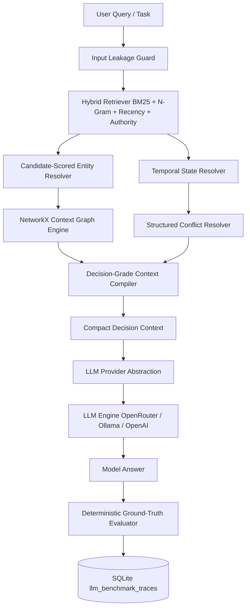

# 🛠️ ContextOS Technical Deep Dive

This document provides a comprehensive technical breakdown of the ContextOS architecture, context pipeline, subsystem algorithms, and evaluation mechanics.

---

## 1. System Architecture

ContextOS is organized into modular packages adhering to strict boundary separation between retrieval, memory, graph, composition, LLM execution, and evaluation.



---

## 2. Subsystem Deep Dives

### 2.1 Hybrid Retrieval (`packages/retrieval/hybrid_retriever.py`)
Combines six distinct signals to calculate document candidate scores:

$$\text{Score}(d, q) = w_1 \cdot \text{BM25}(q, d) + w_2 \cdot \text{NGramSim}(q, d) + w_3 \cdot \text{EntityHits}(d) + w_4 \cdot \text{RecencyDecay}(t_d) + w_5 \cdot \text{GraphDistance}(d) + w_6 \cdot \text{Authority}(s_d)$$

**Source Authority Hierarchy:**
- `CRM` (1.0)
- `Meeting Note` (0.85)
- `Email` (0.75)
- `Slack` (0.65)
- `Note` (0.50)

Pre-filtering retains the top 30 candidate documents before graph traversal.

---

### 2.2 Candidate-Scored Entity Resolution (`packages/retrieval/entity_resolver.py`)
Disambiguates individuals using a weighted multi-attribute scoring model:

| Attribute | Weight | Match Condition |
|---|---|---|
| `email` | 0.35 | Exact email match in query |
| `exact_name` | 0.25 | Full name or part match in query |
| `role` | 0.20 | Role match (e.g. `VP Sales` vs `Associate`) |
| `department` | 0.10 | Department match (e.g. `Executive Sales`) |
| `suffix` | 0.10 | Suffix match (e.g. `Jr.` vs Sr./None) |
| `company` | 0.05 | Company name match |
| `alias` | 0.10 | Alias match |
| `relationship` | 0.05 | Workspace evidence co-occurrence |

#### Ambiguity Rule:
If $\Delta(\text{Score}_{\text{top}}, \text{Score}_{\text{second}}) < 0.15$ and no explicit email or suffix signal exists, the resolver marks `is_ambiguous = True`.

---

### 2.3 Temporal State Resolution (`packages/retrieval/temporal_resolver.py`)
Parses communications into discrete state transition events:

$$\text{Event}_i = (\text{event\_id}, \text{timestamp}, \text{entity\_id}, \text{attribute}, \text{old\_value}, \text{new\_value}, \text{source}, \text{authority}, \text{valid\_from}, \text{valid\_until})$$

Reconstructs the active state valid at $T_{\text{query}}$:
$$\text{ActiveState}(T_{\text{query}}) = \arg\max_{e \in \text{Events}(T_{\text{query}})} (\text{valid\_from}_e, \text{authority}_e, \text{confidence}_e)$$

Events preceding the active state are recorded in `superseded_events`.

---

### 2.4 Decision-Grade Context Compiler (`packages/context/context_compiler.py`)
Transforms subsystem outputs into a concise, deterministic structured text representation:

```text
=== DECISION-GRADE CONTEXT ===
QUERY: [User Query]

[ENTITIES]
- Canonical entity name, email, role, department, company

[CURRENT STATE]
- Attribute, active value, valid as of date

[TIMELINE]
- Chronological state transition events

[RELATIONSHIPS]
- Graph traversal path

[EVIDENCE PROVENANCE]
- Document ID, source, timestamp, authority, content snippet

[CONFLICT RESOLUTION]
- Conflict detected status, resolution, winning evidence, superseded evidence, reason

[ANSWERABILITY]
- SUFFICIENT | INSUFFICIENT | AMBIGUOUS | CONFLICTED

[CONFIDENCE]
- Confidence score (0.0 to 1.0)
```

---

## 3. Benchmark Reproducibility & Integrity Mechanics

### 3.1 Frozen Dataset v1
- **File:** `benchmarks/datasets/v1/dataset.json`
- **SHA256 Hash:** `2ba2719180060804d7a6fdaf0fd132e27ccb1e78f0a54ec8adff6855f57b12fa`
- **Seed:** `42`
- **Verification Function:** `packages/scenarios/stratified.py::load_and_verify_dataset_v1()`

### 3.2 Zero Ground-Truth Leakage Protection
Before tasks reach any agent, `assert_no_ground_truth_leakage(task)` strips:
- `task_category`
- `expected_answer`
- `expected_action`
- `failure_class`
- `ground_truth`

### 3.3 Trace Persistence Schema (`llm_benchmark_traces`)
SQLite table `benchmarks/contextos_benchmark.db` stores per-scenario evaluation traces:
- `run_id`, `scenario_id`, `category`, `agent_name`, `provider`, `model`
- `system_prompt_hash` (SHA256)
- `user_prompt_hash` (SHA256)
- `context_hash` (SHA256)
- `input_tokens`, `output_tokens`, `latency_ms`, `cost_usd`
- `execution_status` (`SUCCESS`, `ERROR`, `EXECUTION_ERROR`)
- `git_commit`
