# 🧬 ContextOS Phase 2.2 — End-to-End Context Pipeline Architecture

This document specifies the internal data flow, state resolvers, and decision pipeline of the **ContextOS Agent** operating in deterministic evaluation mode.

---

## 📐 End-to-End Mermaid Sequence Diagram

```mermaid
sequenceDiagram
    autonumber
    actor User as Agent/User Query
    participant Clean as Input Sanitizer
    participant Retriever as Hybrid Retriever
    participant Entity as Entity Resolver
    participant Temporal as Temporal State Resolver
    participant Graph as Context Graph Engine
    participant Memory as Memory Ranker
    participant Composer as Context Composer
    participant Evaluator as Evaluation Engine

    User->>Clean: Query Task Payload
    Note over Clean: Strip forbidden ground-truth fields<br/>Assert zero leakage
    Clean->>Retriever: Clean Query + Raw Workspace
    
    rect rgb(20, 25, 40)
        Note over Retriever: 1. Lexical BM25 Score<br/>2. N-gram Cosine Similarity<br/>3. Entity Matches<br/>4. Temporal Recency<br/>5. Source Priority (CRM > Note)<br/>6. Relationship Distance
        Retriever-->>Retriever: Compute Normalized Retrieval Score
    end
    
    Retriever->>Entity: Scored Evidence Items
    Entity->>Entity: Disambiguate Email, Role, Department & Name
    Entity-->>Temporal: Canonical Entity Resolution
    
    Temporal->>Temporal: Reconstruct Historical Event Timeline<br/>(Valid-From -> Valid-Until as of Query Time)
    Temporal-->>Graph: Valid Temporal State
    
    Graph->>Graph: Bounded Traversal (Max Depth = 3)<br/>Person -> Project -> Meeting -> Decision
    Graph-->>Memory: Relationship Path Trace
    
    rect rgb(30, 20, 40)
        Note over Memory: Memory Relevance Model<br/>Relevance + Importance > Recency<br/>Vault Credentials & Holds retain 1.0 importance
        Memory-->>Composer: Ranked MemoryScores
    end

    Composer->>Composer: Assemble Facts, Timeline, Conflicts & Provenance<br/>(Enforce Token Budget <= 8000)
    Composer-->>Evaluator: Composed Context & Final Response
    Evaluator->>Evaluator: Assert Ground Truth Facts & Classify Earliest Failure
```

---

## 🔬 Subsystem Definitions

### 1. **Hybrid Retrieval (`packages/retrieval/hybrid_retriever.py`)**
Combines 6 distinct signal channels into a unified evidence score:
$$\text{Score} = w_{\text{lexical}} S_{\text{lex}} + w_{\text{semantic}} S_{\text{sem}} + w_{\text{entity}} S_{\text{ent}} + w_{\text{temporal}} S_{\text{temp}} + w_{\text{relationship}} S_{\text{rel}} + w_{\text{source}} S_{\text{src}}$$

### 2. **Memory Ranking (`packages/memory/memory_ranker.py`)**
Ensures recency does not automatically override task relevance. Credentials, security bypass codes, and legal notices maintain high importance scores across long time horizons.

### 3. **Entity Resolution (`packages/retrieval/entity_resolver.py`)**
Disambiguates duplicate names (e.g. `John Smith` VP Sales vs `John Smith Jr.` Sales Associate) by matching emails, roles, and organizational departments.

### 4. **Temporal State Reconstruction (`packages/retrieval/temporal_resolver.py`)**
Parses event streams to resolve entity attributes valid at specific historical timestamps ($T_{\text{query}}$) rather than defaulting to the latest message.

### 5. **Context Composition (`packages/memory/context_composer.py`)**
Applies source authority hierarchy (`CRM > Meeting Note > Email > Slack > Note`) to resolve conflicting statements without exceeding the configured token budget.
